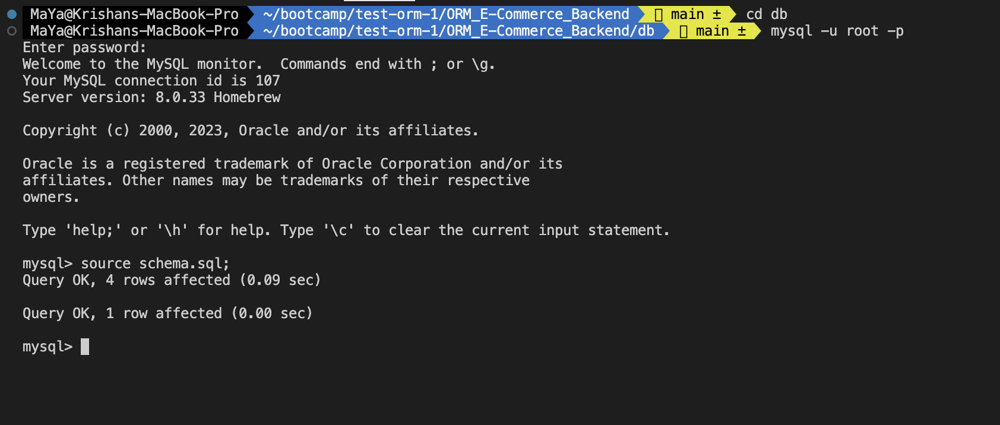
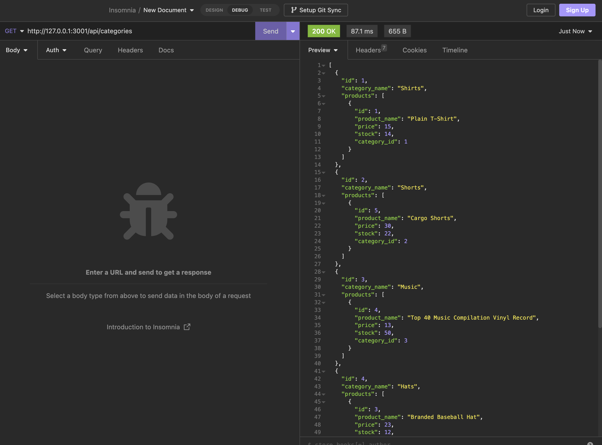

# E-Commerce_Backend

## Description

This command line application is designed to build the back end for an e-commerce site using the latest technologies and adhering to the principles of Object-Relational Mapping (ORM). By leveraging Express.js and Sequelize, a powerful API is created to interact with a MySQL database effectively.
Please visit the demo [here](https://drive.google.com/file/d/1P0dGjfP1wIIe0ubRDdHFpKCjeqL6VNt6/view?usp=sharing).

## Table of Contents
- [Installation](#installation)
- [Usage](#usage)
- [Credit](#credit)
- [License](#license)

## Installation
1. Clone the repository to your local.
2. To install the required dependencies, run `npm install` on your terminal.
3. Rename the `.env.EXAMPLE` file into `.env` and fill in the DB_USER and DB_PASSWORD with your details and save the file.

## Usage 
1. Ensure that you have set up and configured the MySQL database correctly.

2. Navigate to db directory and open the mySql shell and execute the schema.sql by running `source schema.sql` to create database.

3. Navigate to root directory and run `npm run seed` to seed data to your database.

4. Run `npm start` to start the server

5. Test the routes in insomnia

## Credit
- Assistance from tutor 

- [Bootcamp Gitlab 13-ORM](https://git.bootcampcontent.com/University-of-Adelaide/UADEL-VIRT-FSF-PT-03-2023-U-LOLC/-/tree/main/13-ORM/02-Challenge)

## License
Please refer to the LICENSE in the repo.
